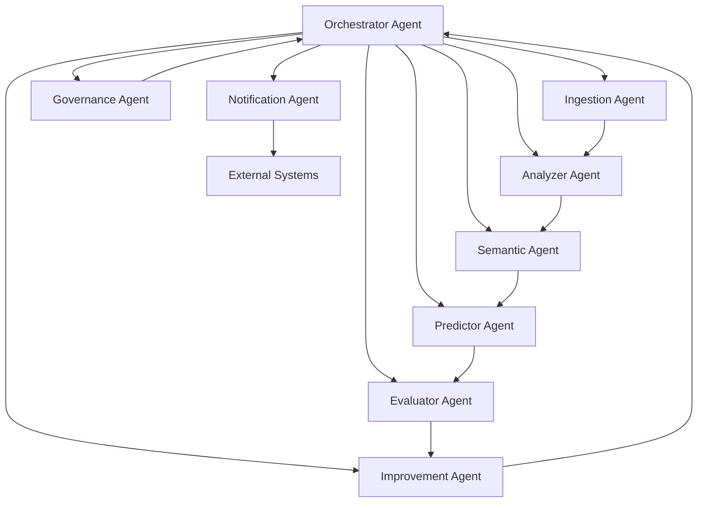

# TikTok Trend Prediction System - Agent Roles & Scheduling Matrix

## Overview
This document defines the responsibilities, inputs, outputs, and scheduling for all agents in the TikTok trend prediction system.

## Agent Architecture



## 1. Orchestrator Agent

**Primary Responsibility**: Master scheduler and workflow coordinator

### Inputs:
- System configuration and cadence settings
- Agent health status reports
- External trigger events (manual requests, alerts)
- Resource availability metrics

### Outputs:
- Agent task assignments
- Workflow execution plans
- Resource allocation decisions
- System status reports

### Core Functions:
- Schedule all agent tasks based on defined cadences
- Monitor agent dependencies and prevent deadlocks
- Handle task prioritization and resource conflicts
- Trigger emergency workflows (drift detection, failures)
- Maintain system heartbeat and health monitoring

### Decision Logic:
```python
def schedule_agents():
    if drift_detected:
        prioritize_retraining_workflow()
    elif data_freshness_violation:
        expedite_ingestion_pipeline()
    else:
        execute_normal_cadence()
```

---

## 2. Ingestion Agent

**Primary Responsibility**: Data acquisition and raw staging

### Inputs:
- Apify actor configurations
- Ingestion schedule from Orchestrator  
- Rate limiting parameters
- Data validation rules

### Outputs:
- Raw TikTok data from Apify scrapers
- Ingestion batch metadata
- Data quality alerts
- Volume and latency metrics

### Core Functions:
- Execute Apify TikTok scraping actors
- Validate incoming data schemas
- Implement idempotency controls (deduplication)
- Monitor rate limits and API quotas
- Log ingestion volumes and success rates

### Error Handling:
- Retry failed API calls with exponential backoff
- Alert on sustained API failures or quota exhaustion
- Quarantine malformed data for manual review

---

## 3. Analyzer Agent

**Primary Responsibility**: Quantitative metrics computation

### Inputs:
- Normalized hashtag, video, creator, sound data
- Previous metric calculations for time-series features
- Feature computation specifications
- Data quality validation results

### Outputs:
- Quantitative metrics (velocity, acceleration, momentum)
- Time-series feature vectors
- Emerging trend candidates
- Computation performance logs

### Core Functions:
- **Velocity Calculation**: `(current_window - previous_window) / previous_window`
- **Acceleration**: `(current_velocity - previous_velocity) / |previous_velocity|`
- **Momentum Score**: Weighted combination (0.4 velocity + 0.3 acceleration + 0.2 engagement + 0.1 diversity)
- **Novelty Index**: Inverse overlap with baseline period creators/sounds
- **Persistence Modeling**: Exponential decay fitting for half-life estimation

### Quality Assurance:
- Validate metric ranges and outlier detection
- Cross-check temporal consistency
- Flag suspicious spikes or drops

---

## 4. Semantic Agent (LLM-Powered)

**Primary Responsibility**: Semantic enrichment and narrative generation

### Inputs:
- Quantitative metrics from Analyzer Agent
- Raw content data (captions, hashtag names)
- Historical cluster assignments
- LLM prompt templates (versioned)

### Outputs:
- Theme labels and cluster assignments
- Trend narratives and explanations
- Cross-theme collision alerts
- Synthetic counterfactual scenarios
- Risk/noise flags for artificial boosting

### Core Functions:
- **Clustering**: Vector-based hashtag similarity grouping
- **Theme Labeling**: Generate 2-3 word stable vocabulary labels
- **Narrative Generation**: Explain momentum reasons using metrics + context
- **Anomaly Detection**: Flag artificial boosting patterns
- **Counterfactual Generation**: "What if" scenarios for feature stress testing

### LLM Prompt Templates:
```
Theme Labeling Prompt v1:
"Based on these trending hashtags and their associated content: {hashtag_data}
Generate a 2-3 word theme label that captures the common semantic thread.
Constraints: Use existing vocabulary from {theme_vocabulary}
Output format: {"theme": "word1_word2", "confidence": 0.85}"
```

### Quality Controls:
- Maintain prompt performance metrics (acceptance rate)
- Detect hallucinations via rule-based checks
- Version control all prompt templates

---

## 5. Predictor Agent

**Primary Responsibility**: ML model inference and ranking

### Inputs:
- Feature vectors from Analyzer and Semantic agents
- Latest trained models (versioned)
- Prediction configuration (horizon, thresholds)
- Model metadata and performance benchmarks

### Outputs:
- Viral probability predictions per hashtag
- Ranked prediction lists (top-K candidates)
- Prediction confidence intervals
- Model explanation features (SHAP values)

### Core Functions:
- Load latest promoted model version
- Execute batch prediction on current feature set
- Apply ranking rules (filter noise, boost novelty)
- Generate uncertainty estimates
- Store predictions with model provenance

### Model Management:
- Automatic model loading from model registry
- Fallback to previous version on load failures
- Performance monitoring and automatic rollback triggers

---

## 6. Evaluator Agent

**Primary Responsibility**: Prediction performance assessment

### Inputs:
- Historical predictions with timestamps
- Realized viral outcomes (ground truth labels)
- Evaluation metric definitions
- Performance threshold configurations

### Outputs:
- Daily evaluation reports
- Model performance metrics (AUC, PR-AUC, calibration)
- Miss analysis categorization
- Drift detection alerts
- Model promotion/demotion recommendations

### Core Functions:
- **Daily Alignment**: Compare predicted top-K vs actual top-K
- **Attribution Analysis**: Categorize prediction misses (late detection, mislabeling, feature gaps)
- **Drift Monitoring**: Track feature distribution shifts and label prevalence
- **Performance Trending**: Monitor metric trajectories over time

### Evaluation Metrics:
- AUC-ROC and PR-AUC
- Precision@K and Recall@K
- Calibration error (Brier score)
- Lead time analysis (hours before actual surge)

---

## 7. Improvement Agent (LLM-Powered)

**Primary Responsibility**: Continuous system optimization

### Inputs:
- Evaluation reports from Evaluator Agent
- Error analysis summaries
- System performance logs
- Historical improvement task outcomes

### Outputs:
- Prioritized improvement task backlog
- Feature engineering recommendations
- Prompt optimization suggestions
- Architecture enhancement proposals

### Core Functions:
- **Error Analysis**: Digest evaluation results via LLM reasoning
- **Task Generation**: Create specific, actionable improvement tasks
- **Priority Ranking**: Score tasks by expected impact vs effort
- **Success Tracking**: Monitor outcomes of implemented improvements

### LLM Analysis Prompt:
```
"Given these prediction misses: {miss_data} and performance metrics: {metrics}
Analyze the root causes and generate 3-5 specific improvement tasks.
Format each as: {task: 'description', category: 'feature/model/prompt/infra', priority: 1-5}"
```

---

## 8. Governance Agent

**Primary Responsibility**: Policy compliance and safety guardrails

### Inputs:
- System configuration and policy rules
- LLM outputs from Semantic and Improvement agents
- API usage metrics
- Data privacy requirements

### Outputs:
- Policy compliance reports
- LLM output validation results
- Resource usage alerts
- Security and privacy audit logs

### Core Functions:
- **LLM Output Validation**: Ensure grounded outputs, block generic phrases
- **Rate Limit Monitoring**: Track API usage against quotas
- **PII Detection**: Scan for accidentally ingested personal information
- **License Compliance**: Verify data usage rights and attribution

### Validation Rules:
- LLM cannot assert metrics not present in source data
- Engagement rates must be ≤ 1.0
- Blocked phrases: "awesome trend", "very viral", etc.
- All numerical claims must cite metric IDs or timestamps

---

## 9. Notification Agent

**Primary Responsibility**: Alert management and external communication

### Inputs:
- System alerts from all other agents
- Performance threshold violations
- Emerging trend detections
- System health status changes

### Outputs:
- Formatted alerts to external systems
- Dashboard updates
- Email/Slack notifications
- Mobile push notifications (if configured)

### Core Functions:
- **Alert Prioritization**: Critical, high, medium, low severity levels
- **Notification Routing**: Send to appropriate channels based on alert type
- **Alert Suppression**: Prevent spam from repeated similar alerts
- **Escalation Management**: Escalate unresolved critical alerts

### Alert Types:
- Emerging trend detected (virality predicted)
- Model performance degradation
- Data pipeline failures
- API rate limit approaching
- System health issues

---

## Scheduling Matrix

| Agent | Frequency | Trigger Type | Dependencies | Duration Estimate |
|-------|-----------|--------------|--------------|------------------|
| **Orchestrator** | Continuous | Always On | None | N/A |
| **Ingestion** | Every 15 min | Schedule + On-Demand | None | 2-5 minutes |
| **Analyzer** | Every 60 min | Data Trigger | Ingestion Complete | 10-20 minutes |
| **Semantic** | Every 4 hours | Data Trigger | Analyzer Complete | 15-30 minutes |
| **Predictor** | Every 60 min | Feature Trigger | Analyzer + Semantic | 5-10 minutes |
| **Evaluator** | Daily (2 AM) | Schedule | 24h of Predictions | 10-15 minutes |
| **Improvement** | Weekly (Sun) | Schedule | Evaluator Reports | 30-60 minutes |
| **Governance** | Every 30 min | Schedule + Event | Any LLM Output | 1-3 minutes |
| **Notification** | Real-time | Event Trigger | Any Alert | < 1 minute |

## Detailed Cadence Configuration

### High-Frequency Operations (< 1 hour)
```yaml
ingestion_agent:
  normal_cadence: "*/15 * * * *"  # Every 15 minutes
  emergency_cadence: "*/5 * * * *"  # Every 5 minutes when backlog > threshold
  
predictor_agent:
  normal_cadence: "0 * * * *"  # Every hour at minute 0
  dependencies: ["analyzer_complete", "features_fresh"]
  
governance_agent:
  normal_cadence: "*/30 * * * *"  # Every 30 minutes
  event_trigger: true  # Also triggered by LLM outputs
```

### Medium-Frequency Operations (1-24 hours)
```yaml
analyzer_agent:
  normal_cadence: "10 * * * *"  # Every hour at minute 10
  dependencies: ["ingestion_batch_complete"]
  
semantic_agent:
  normal_cadence: "0 */4 * * *"  # Every 4 hours
  dependencies: ["analyzer_metrics_available"]
  
evaluator_agent:
  normal_cadence: "0 2 * * *"  # Daily at 2 AM
  dependencies: ["24h_predictions_available"]
```

### Low-Frequency Operations (> 24 hours)
```yaml
improvement_agent:
  normal_cadence: "0 3 * * 0"  # Weekly on Sunday at 3 AM
  dependencies: ["weekly_evaluation_complete"]
  
model_retrain:
  drift_trigger: true
  max_cadence: "0 4 * * 1"  # Weekly on Monday at 4 AM
  
architecture_review:
  normal_cadence: "0 5 1 * *"  # Monthly on 1st at 5 AM
```

## Resource Allocation & Concurrency

| Agent | Max Concurrent | CPU Priority | Memory Limit | GPU Required |
|-------|----------------|--------------|--------------|--------------|
| Orchestrator | 1 | High | 512 MB | No |
| Ingestion | 3 | Medium | 1 GB | No |
| Analyzer | 2 | High | 2 GB | No |
| Semantic | 1 | Medium | 4 GB | Optional |
| Predictor | 2 | High | 3 GB | Optional |
| Evaluator | 1 | Low | 2 GB | No |
| Improvement | 1 | Low | 1 GB | No |
| Governance | 5 | High | 256 MB | No |
| Notification | 10 | High | 128 MB | No |

## Failure Recovery Procedures

### Agent Failure Responses
```python
def handle_agent_failure(agent_name, failure_type):
    if agent_name == "ingestion" and failure_type == "api_limit":
        switch_to_backup_endpoints()
        reduce_request_frequency()
    elif agent_name == "predictor" and failure_type == "model_load_error":
        rollback_to_previous_model()
        alert_ml_team()
    elif agent_name == "semantic" and failure_type == "llm_timeout":
        use_cached_results()
        schedule_retry_with_backoff()
```

### Dependency Chain Recovery
- If Ingestion fails: Hold downstream agents, retry with exponential backoff
- If Analyzer fails: Use last computed metrics, alert for manual intervention  
- If Semantic fails: Skip semantic enrichment, proceed with quantitative features only
- If Predictor fails: Serve last cached predictions, investigate immediately

## Monitoring & Observability

### Agent Health Metrics
- Task completion rates
- Average execution times
- Resource utilization
- Error rates and types
- Queue depths and backlogs

### System-Level KPIs
- End-to-end latency (ingestion → prediction)
- Prediction accuracy trends
- Data freshness violations
- Alert resolution times
- Agent uptime percentages 